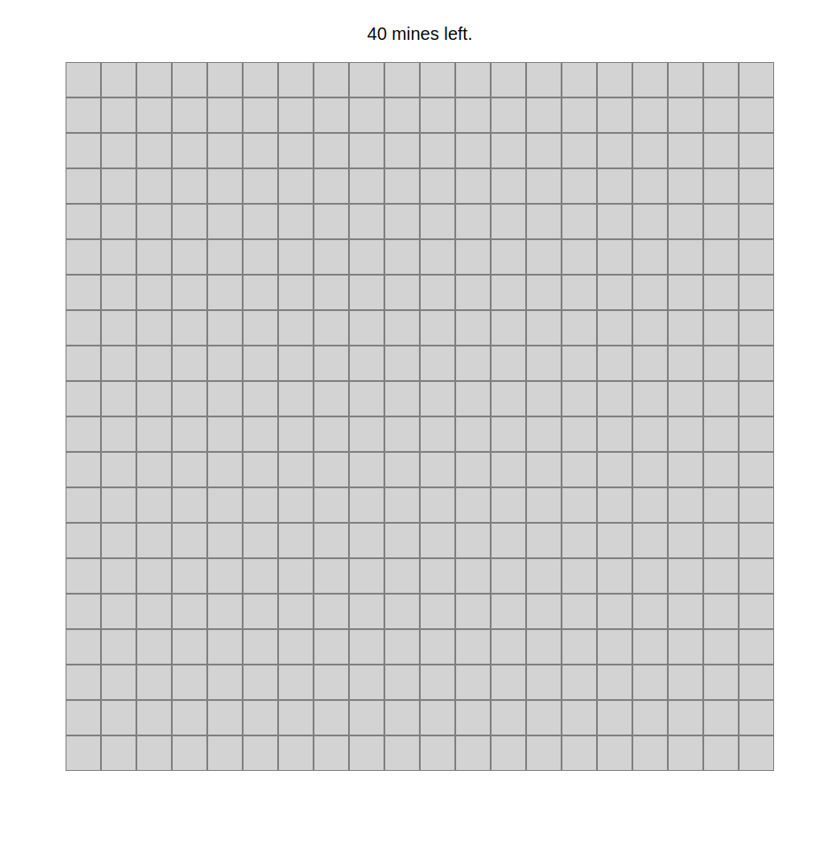
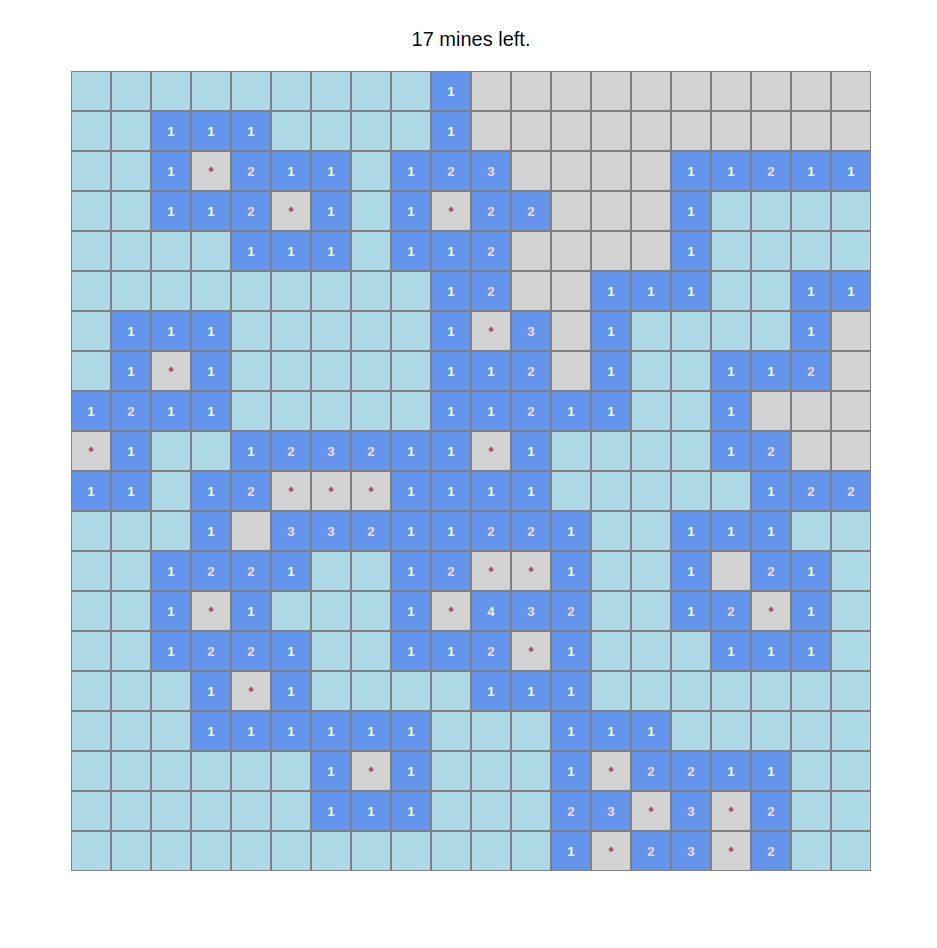
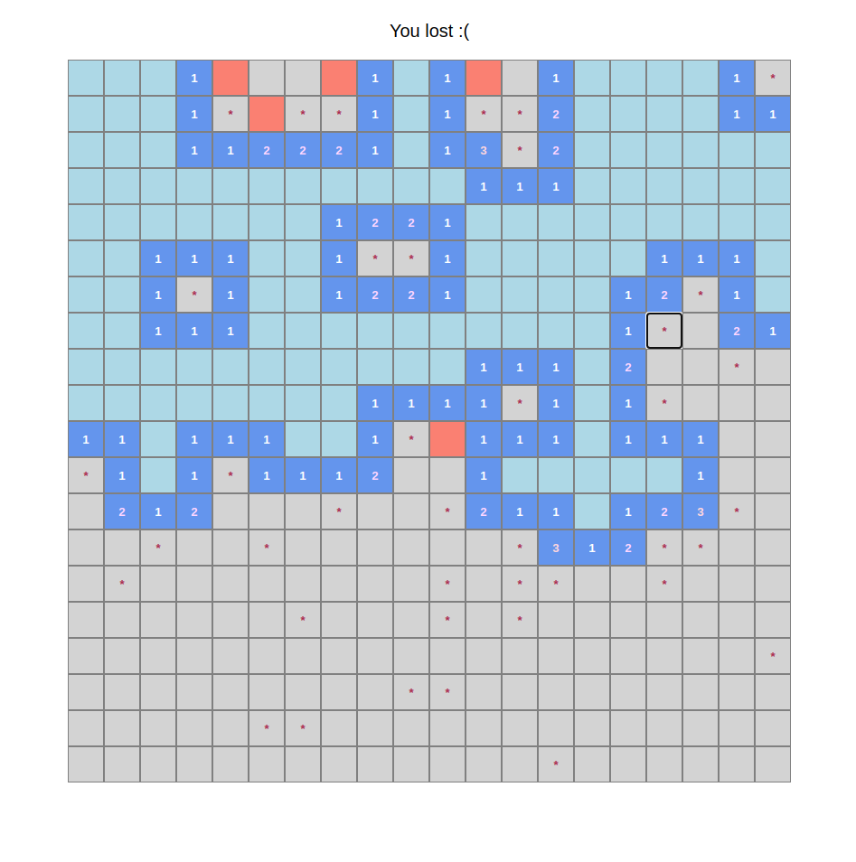
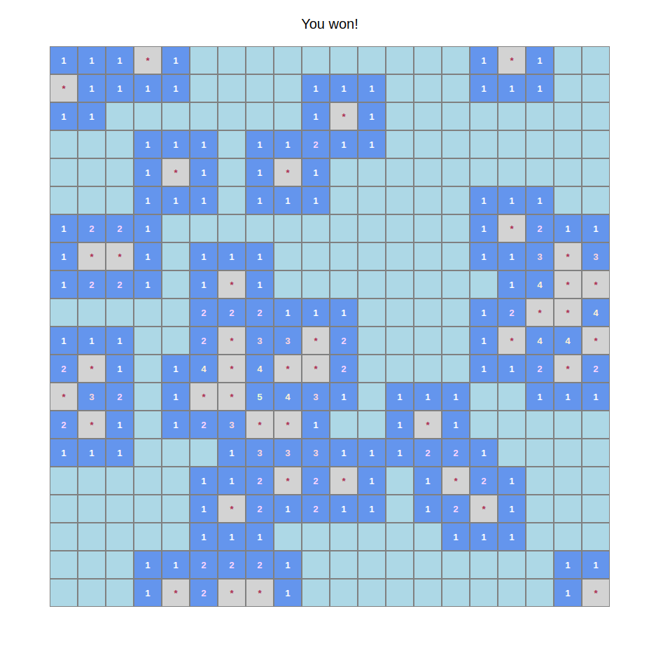

## Minesweeper

This Minesweeper implementation uses *HTML*, *CSS*, and *Javascript* with the *React* framework.

The game's settings can be changed through url options: `w` for width, `h` for height, and `m` for the number of mines. For example, adding

```
?w=10&h=10&m=20
```
to the url creates a 10x10 minesweeper board with 20 mines.

The default parameters are `w=20`, `h=20`, and `m=40`.

The game guarantees that the first cell and its neighbours do not have mines. For cells with 0 neighbouring mines, the neighbours are automatically cleared.

## Screenshots







